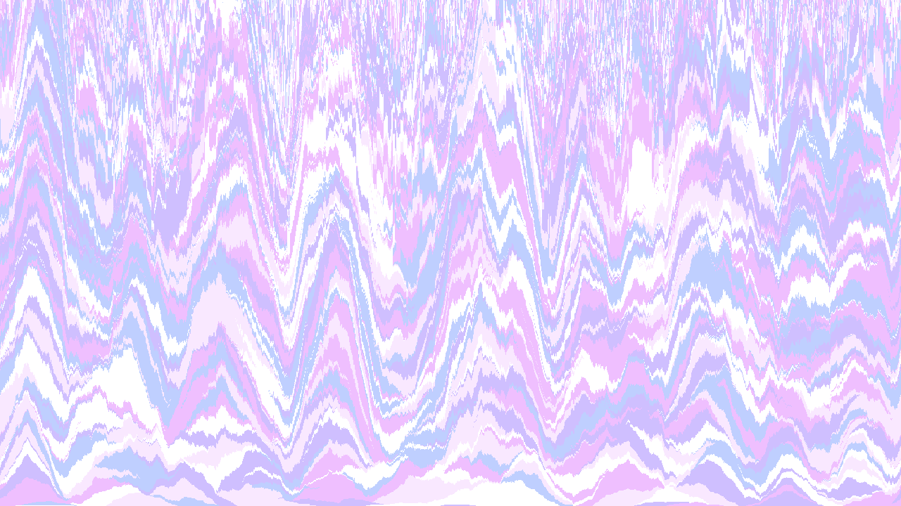

# 랜덤 이미지 생성
## 2025년 1월 12일 Sand.java 추가
RandomImgGenerator 상속받지 않은 별도 클래스  
width, height, colors, 마지막 파일 생성 부분 필요에 따라 수정해서 사용  

## RandomImgGenerator.java
원하는 패턴의 클래스 생성한 후 make()
### 클래스 목록
- Bomb(기본), Bomb2(네 방향 확률 설정), Bomb3(기본 방향, 대각선 방향 확률 설정), Bomb4(여덟 방향 확률 설정)
- HorizontalStripe
- FineHorizontalStripe
- VerticalStripe
- FineVerticalStripe
- DiagonalStripe
- FineDiagonalStripe
### 예시 코드
RandImgGenerator.java
- 저장 위치 수정: save()
- 이미지 크기 수정: field의 width, height
### Bomb 생성자
- 최대 색 차이(int)
- 확장 확률(double 또는 double[])
- 개수 설정할 때 나누는 수(int)
### Stripe, Fine Stripe 생성자
최대 색 차이(int)  
방향
- 가로(Horizontal)
- 세로(Vertical)
- 대각선(Diagonal)
# 결과 예시
|Bomb1|     |Bomb2|Bomb3|Bomb4|
|-----|-----|-----|-----|-----|
||||||

|      |Stripe|      |
|------|------|------|
||||
||||

