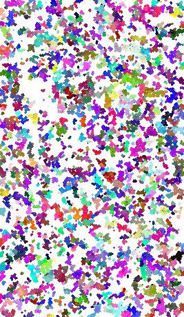
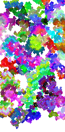
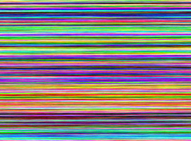
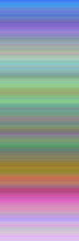
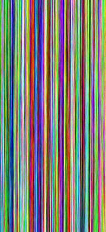
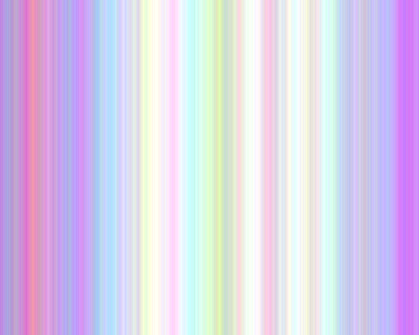
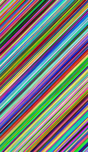
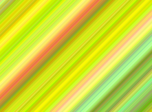

# 랜덤 이미지 생성
원하는 패턴의 클래스 생성한 후 make()
### 클래스 목록
- Bomb(기본), Bomb2(네 방향 확률 설정), Bomb3(기본 방향, 대각선 방향 확률 설정), Bomb4(여덟 방향 확률 설정)
- HorizontalStripe
- FineHorizontalStripe
- VerticalStripe
- FineVerticalStripe
- DiagonalStripe
- FineDiagonalStripe
### 예시 코드
RandImgGenerator.java
- 저장 위치 수정: save()
- 이미지 크기 수정: field의 width, height
## Bomb 생성자
- 최대 색 차이(int)
- 확장 확률(double 또는 double[])
- 개수 설정할 때 나누는 수(int)
## Stripe, Fine Stripe 생성자
최대 색 차이(int)

방향
- 가로(Horizontal)
- 세로(Vertical)
- 대각선(Diagonal)
# 결과

    
    

    
    

    
    

    
    

